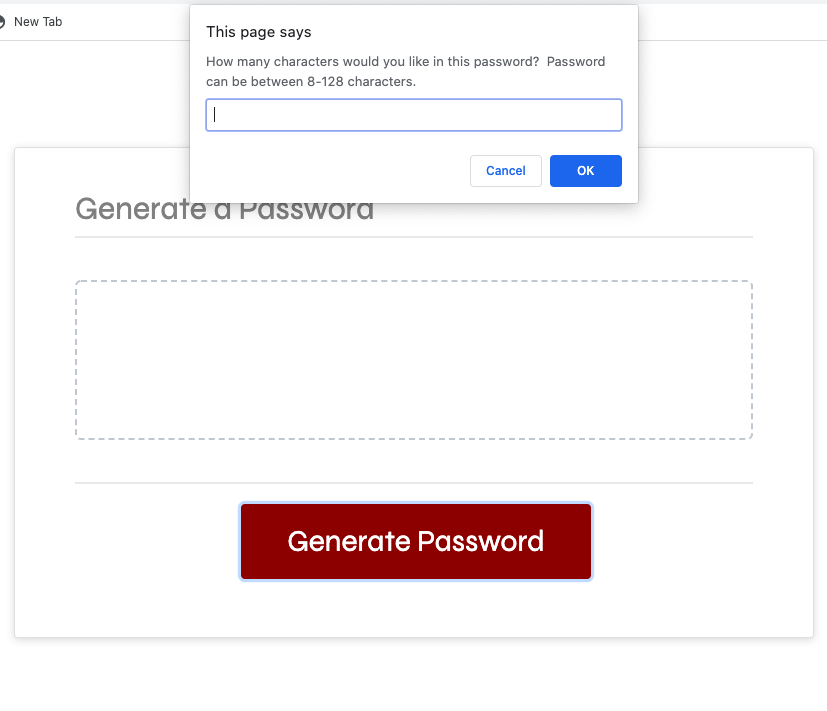
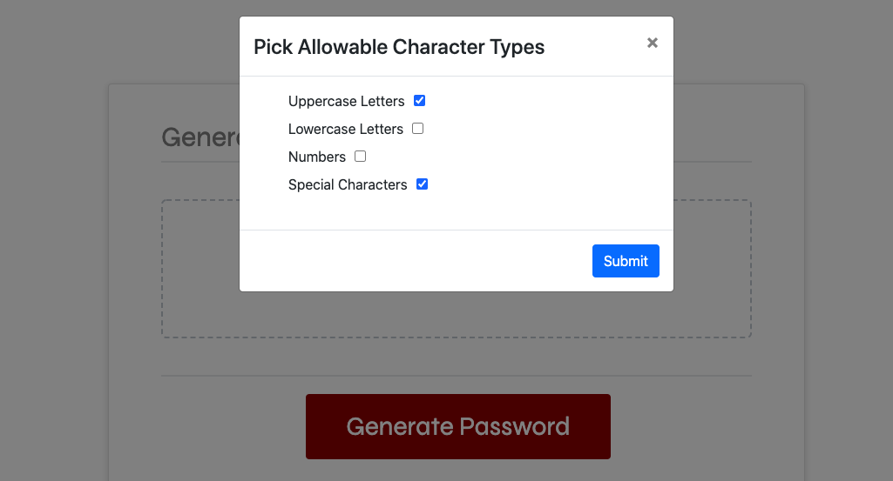
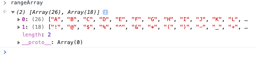
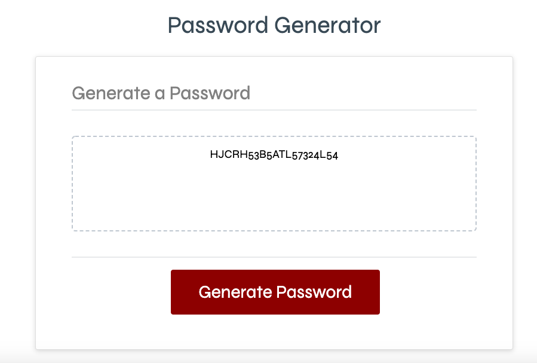

#PURPOSE:
The password-generator app creates a string based on a series of prompts.  The end user control both the length of the string, and the allowable characters.

#LANGUAGES USED:
HTML (Bootstrap Framework), CSS and Javascript

#METHODOLOGIES:
Most of this app's functionality comes from a battery of Javascript functions that handle
smaller parts of the process.

A rough sketch of the process can be described as follows:

(1) End-user (EU) is prompted for password length.  EU submits. 

 

(2) Function checks that valid characters are used, and volleys to a second function that validates length. If valid, the length is pushed to a global variable.

(3) EU is shown a modal that allows them to check off allowable character types in the password.  When EU submits, a function turns the user's choices into JSON.  

 

(4) Then, from that JSON object, arrays are created. Each array is populated with an allowable character set.  These arrays are all housed in a parent array.

 

(5) The pre-password is created from these separate "sub-arrays".

(6) Because of the possible predictability of a string created
by repeated "looplike" passovers on an array, one more step is needed to scramble the 
results.  For example, if the EU selected only Uppercase and Special characters for their pw, their initial pw string would contain a pattern of Uppercase, Special, Uppercase, Special.

This step undoes that regularity.

 

